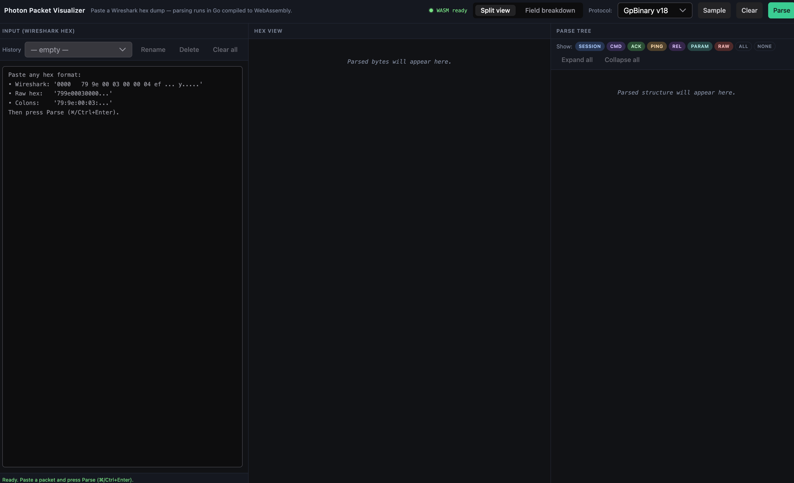

# Photon Packet Visualizer

A [web UI](https://autodruid.github.io/photon-viewer/) for inspecting raw [Photon Protocol](https://doc.photonengine.com/) packets
pasted from Wireshark (or any other source). The actual decoding is delegated to
[AutoDruid/photon-parser](https://github.com/AutoDruid/photon-parser). A Go
library compiled to WebAssembly and called from the browser. This project is
only responsible for the UI, the hex/tree linking, and the small WASM wrapper.



> Both Photon protocol revisions are supported: **v16** and **v18**.

## Prerequisites

[mise](https://mise.jdx.dev/) pins the toolchain so anyone can reproduce the
build:

- **Node 24** and **pnpm 10.28.2** (pinned in `.mise/config.toml`)
- **Go** (any recent version with `GOOS=js GOARCH=wasm` support) — required
  only for rebuilding `public/main.wasm`

Install everything mise can manage:

```bash
mise install
pnpm install
```

## Tasks

The repository defines three mise tasks (see `.mise/config.toml`):

| Task                | What it does                                                                  |
| ------------------- | ----------------------------------------------------------------------------- |
| `mise build`        | `pnpm build` — typecheck + production Vite build into `dist/`.                |
| `mise typecheck`    | `vue-tsc --noEmit` over the whole project.                                    |
| `mise build-wasm`   | Builds `src/parser/main.go` to `public/main.wasm` and copies `wasm_exec.js`.  |

## Building the WASM parser

To build it (e.g. after bumping `photon-parser` in `src/parser/go.mod`):

```bash
mise build-wasm
```

## Running locally

```bash
pnpm dev
```

Then open the printed URL. Paste a Wireshark hex dump into the left pane, pick
the protocol version in the toolbar, and press **Parse** (or `⌘/Ctrl+Enter`).

- **Split view** — input, hex grid, and parse tree side-by-side. Hovering a
  byte highlights the matching tree node and vice versa; clicking scrolls the
  other pane.
- **Field breakdown** — flat, groupable list of every decoded field, useful
  when reverse-engineering an unknown command.

## Disclaimer

This project is for **inspecting and learning** the Photon wire format. It does
not endorse any specific use; you are responsible for complying with the terms
of any service whose traffic you capture or analyze.
